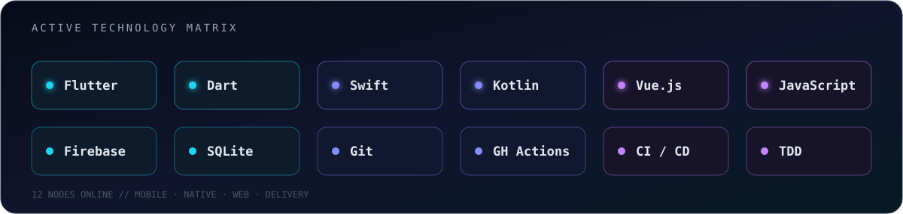
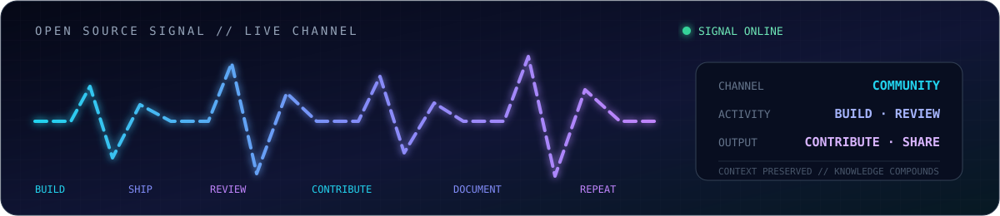

<p align="center">
  <a href="https://www.linkedin.com/in/ghag23"><code>LINKEDIN</code></a>
  &nbsp;·&nbsp;
  <a href="https://github.com/GhagSagar23"><code>GITHUB</code></a>
  &nbsp;·&nbsp;
  <a href="mailto:sagar.ghag1997@gmail.com"><code>EMAIL</code></a>
  &nbsp;·&nbsp;
  <a href="https://pub.dev/packages/livelyness_detection"><code>PUB.DEV</code></a>
</p>

## 01 // SYSTEM_IDENTITY

```typescript
const sagar = {
  role: "Mobile & Frontend Engineer",
  experience: "7+ years building mobile products",
  base: "Pune, India · collaborating globally",
  core: ["Flutter", "Dart", "Cross-platform architecture"],
  native: ["Swift", "Kotlin"],
  web: ["Vue.js", "JavaScript"],
  craft: ["Clean architecture", "Testing", "CI/CD", "Technical leadership"],
  mission: "Turn complex product ideas into dependable experiences.",
};
```

I engineer mobile and web products that feel fast, clear, and intentional. My foundation is in **Flutter and native mobile development**, supported by hands-on frontend work with **Vue.js** and a strong bias toward maintainable systems, thoughtful user experience, and collaborative delivery.

## 02 // ENGINEERING_CONSOLE

<table>
  <tr>
    <td width="33%" valign="top">
      <h3>⚡ Mobile systems</h3>
      <p>Cross-platform architecture, polished interfaces, native integrations, performance, and dependable release workflows.</p>
    </td>
    <td width="33%" valign="top">
      <h3>◈ Product engineering</h3>
      <p>Translating product intent into accessible, responsive experiences through pragmatic technical decisions.</p>
    </td>
    <td width="33%" valign="top">
      <h3>⌁ Engineering culture</h3>
      <p>Clean architecture, TDD, CI/CD, constructive reviews, clear communication, and shared ownership.</p>
    </td>
  </tr>
</table>

## 03 // TECHNOLOGY_MATRIX



## 04 // SELECTED_BUILDS

<table>
  <tr>
    <td width="52%" valign="top">
      <h3>🧬 livelyness_detection</h3>
      <p><strong>Open-source Flutter package</strong></p>
      <p>Camera-based liveness interaction using Google ML Kit facial signals, designed for identity, security, and engagement flows.</p>
      <p>
        <a href="https://pub.dev/packages/livelyness_detection"><strong>Package →</strong></a>
        &nbsp;·&nbsp;
        <a href="https://github.com/Kryonex-Labs/livelyness_detection"><strong>Source →</strong></a>
      </p>
    </td>
    <td width="48%" valign="top">
      <h3>🌐 Web engineering lab</h3>
      <p><strong>Vue.js learning platform</strong></p>
      <p>Hands-on frontend projects with automated progress tracking, modern web foundations, and a live learning dashboard.</p>
      <p>
        <a href="https://github.com/GhagSagar23/vue_js_udemy"><strong>Source →</strong></a>
        &nbsp;·&nbsp;
        <a href="https://ghagsagar23.github.io/vue_js_udemy/"><strong>Live dashboard →</strong></a>
      </p>
    </td>
  </tr>
</table>

## 05 // OPEN_SOURCE_SIGNAL



I contribute through public packages, code review, issue investigation, and practical fixes across the Flutter ecosystem. The goal is simple: leave useful software—and useful context—behind.

<p align="center">
  <a href="https://github.com/GhagSagar23?tab=repositories"><strong>Explore repositories →</strong></a>
  &nbsp;·&nbsp;
  <a href="https://github.com/GhagSagar23?tab=overview&from=2026-08-01&to=2026-08-10"><strong>View contribution activity →</strong></a>
</p>

## 06 // OPERATING_PRINCIPLES

```text
01  Build for the person using the product.
02  Make the architecture earn its complexity.
03  Automate the repeatable; document the surprising.
04  Treat quality as a continuous engineering practice.
05  Share context early and collaborate without ego.
```

## 07 // BEYOND_THE_TERMINAL

When I step away from code, you’ll usually find me on a long motorcycle ride, swimming, playing volleyball, or searching for the next great indie track.

<p align="center">
  <strong>Have an ambitious product, engineering challenge, or open-source idea?</strong>
  <br /><br />
  <a href="mailto:sagar.ghag1997@gmail.com"><code>START_A_CONVERSATION →</code></a>
  <br /><br />
  <sub>Building dependable software · Learning continuously · Contributing openly</sub>
</p>
